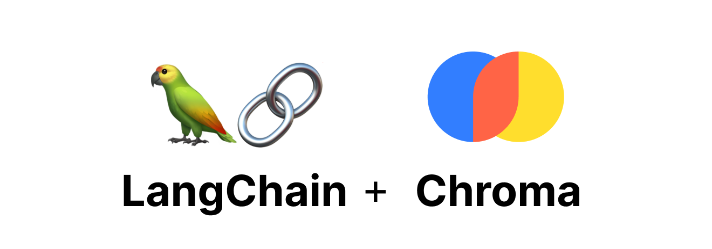
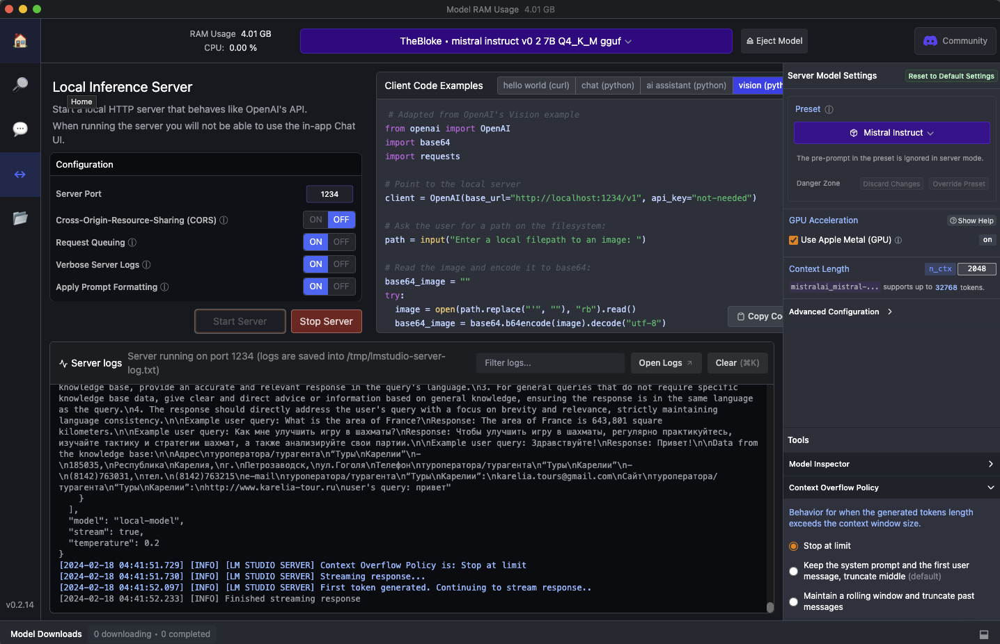

[![Contributors][contributors-shield]][contributors-url]
[![Forks][forks-shield]][forks-url]
[![Stargazers][stars-shield]][stars-url]
[![Issues][issues-shield]][issues-url]
[![MIT License][license-shield]][license-url]


<!-- PROJECT LOGO -->
<br />
<div align="center">
  <a href="https://github.com/RomiconEZ/GenerativeBackend">
    
  </a>

  <h3 align="center">Generative Backend</h3>
<h3 align="center">(Part of the contact center automation service)</h3>

  <p align="center">
    <br />
    <br />
    <a href="https://github.com/RomiconEZ/GenerativeBackend/issues">Report Bug</a>
    ·
    <a href="https://github.com/RomiconEZ/GenerativeBackend/issues">Request Feature</a>
  </p>
</div>


<!-- TABLE OF CONTENTS -->
<details>
  <summary>Table of Contents / Содержание</summary>
  <ol>
    <li>
      <a href="#about-the-project--о-проекте">About The Project / О проекте</a>
      <ul>
        <li><a href="#built-with--технологический-стек">Built With / Технологический стек</a></li>
      </ul>
    </li>
    <li>
      <a href="#getting-started--начало">Getting Started / Начало</a>
      <ul>
        <li><a href="#prerequisites">Prerequisites</a></li>
        <li><a href="#installation--установка">Installation / Установка</a></li>
      </ul>
    </li>
    <li><a href="#license">License</a></li>
    <li><a href="#contact--контакты">Contact / Контакты</a></li>
  </ol>
</details>


<!-- ABOUT THE PROJECT -->
## About The Project / О проекте

Link to project in GitHub: https://github.com/RomiconEZ/GenerativeBackend

Данный Backend сервис является частью система автоматизации контакт-центра для тур-бизнеса.

Он является связующим свеном между чат-ботами для клиентов и для агентов.

Основная цель Backend-а - генерация текстовых и звуковых ответов на вопросы пользователя, 
а также перенаправление пользователей к агентам.

Для ответов на запросы пользователя используется локально развернутая LLM:
IlyaGusev/saiga_mistral_7b_gguf с помощью LM studio и RAG.

В качестве модели для эмбеддингов используется "sentence-transformers/all-MiniLM-L6-v2"

Chroma используется для создания и использования векторного представления текстовых данных.

LangChain используется для обработки и управления текстовыми данными.

База знаний содержит файл с информацией о туроператоре (все совпадения случайны):

<p align="right">(<a href="#readme-top">back to top</a>)</p>


### Built With / Технологический стек

* ![Python][Python.com]
* ![Docker][Docker.com]
* 
* Init Backend Template: https://github.com/igorbenav/FastAPI-boilerplate


<p align="right">(<a href="#readme-top">back to top</a>)</p>


<!-- GETTING STARTED -->
## Getting Started / Начало

### Prerequisites
- Docker: https://www.docker.com/get-started
- LM studio: https://lmstudio.ai
- Download the IlyaGusev/saiga_mistral_7b_gguf model in LM studio

### Installation / Установка

1. Clone the repository.

2. Copy the `.env.example` file in the directory and change the name to `.env`. Customize the env file for your project.

3. Launch the server in LM studio



4. In the terminal, navigate to the root directory of the cloned repository. Build the Docker containers with the following command:
   ```shell
   docker compose up
   ```
   If an error occurred when starting the containers when creating databases, run the command again:
   ```shell
   docker compose up
   ```

### Additionally
* http://127.0.0.1:8000/ - FastAPI документация
* http://127.0.0.1:5050/ - PgAdmin

<!-- LICENSE -->
## License

Distributed under the MIT License.

<p align="right">(<a href="#readme-top">back to top</a>)</p>


<!-- CONTACT -->
## Contact / Контакты

Roman Neronov:
* email: roman.nieronov@gmail.com / roman.nieronov@mail.ru
* telegram: @Romiconchik

<p align="right">(<a href="#readme-top">back to top</a>)</p>


<!-- MARKDOWN LINKS & IMAGES -->
<!-- https://www.markdownguide.org/basic-syntax/#reference-style-links -->
[contributors-shield]: https://img.shields.io/github/contributors/RomiconEZ/GenerativeBackend.svg?style=for-the-badge
[contributors-url]: https://github.com/RomiconEZ/GenerativeBackend/graphs/contributors
[forks-shield]: https://img.shields.io/github/forks/RomiconEZ/GenerativeBackend.svg?style=for-the-badge
[forks-url]: https://github.com/RomiconEZ/GenerativeBackend/network/members
[stars-shield]: https://img.shields.io/github/stars/RomiconEZ/GenerativeBackend.svg?style=for-the-badge
[stars-url]: https://github.com/RomiconEZ/GenerativeBackend/stargazers
[issues-shield]: https://img.shields.io/github/issues/RomiconEZ/GenerativeBackend.svg?style=for-the-badge
[issues-url]: https://github.com/RomiconEZ/GenerativeBackend/issues
[license-shield]: https://img.shields.io/github/license/RomiconEZ/GenerativeBackend.svg?style=for-the-badge
[license-url]: https://github.com/RomiconEZ/GenerativeBackend/blob/master/LICENSE.txt
[product-screenshot]: readme_images/backend_logo.png


[Python.com]: https://img.shields.io/badge/Python-14354C?style=for-the-badge&logo=python&logoColor=white

[fastapi.com]: https://img.shields.io/badge/FastAPI-005571?style=for-the-badge&logo=fastapi

[Docker.com]: https://img.shields.io/badge/docker-%230db7ed.svg?style=for-the-badge&logo=docker&logoColor=white

